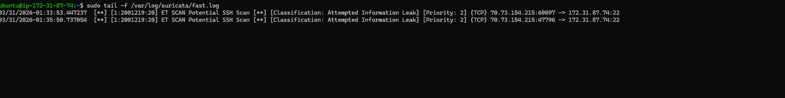
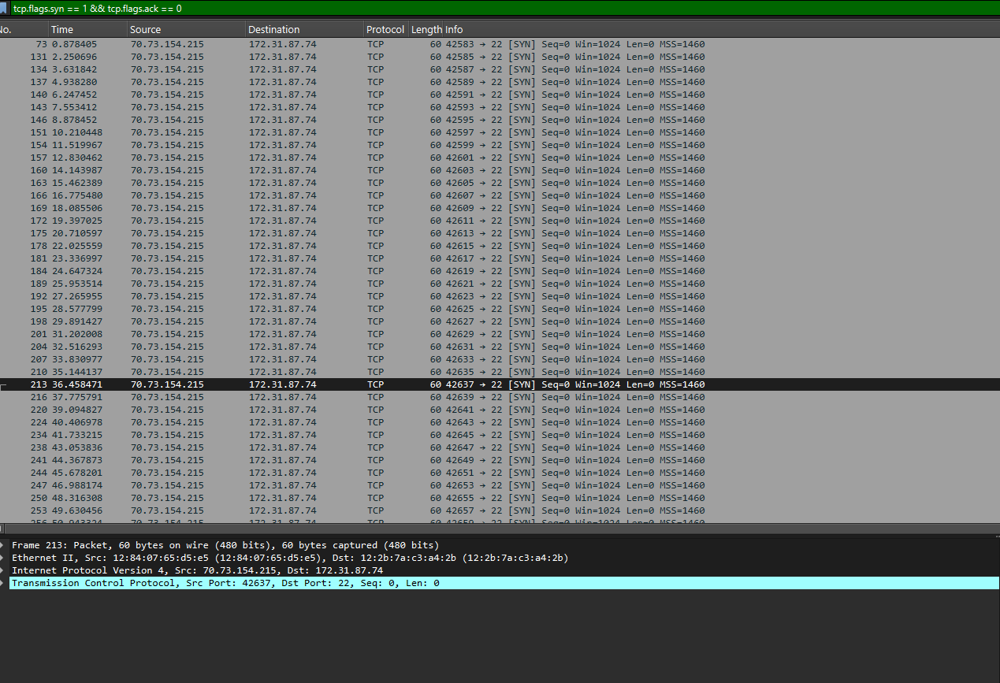
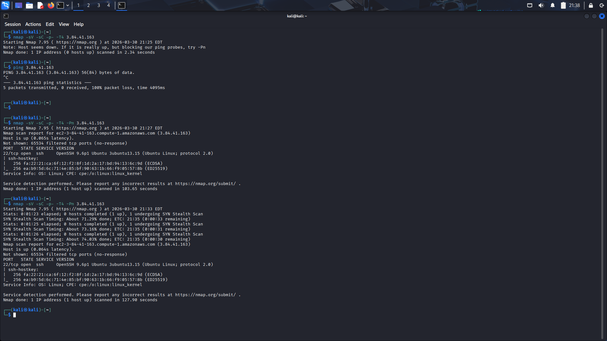

# AWS EC2 Intrusion Detection Lab (Suricata + Wireshark)

## Summary
Built a cloud-based intrusion detection lab on AWS EC2 using Suricata, tcpdump, and Wireshark. Simulated attacker traffic from a Kali Linux machine and performed packet-level forensic analysis to validate IDS alerts in a SOC-style workflow.

---

## Objective
Deploy and configure a network intrusion detection system in a cloud environment, simulate malicious activity, and correlate Suricata alerts with raw packet captures to verify attack behavior.

---

## Environment

- AWS EC2 (Ubuntu Server) — IDS host running Suricata
- Kali Linux — attacker machine using Nmap
- Local machine — analysis workstation using Wireshark

---

## Tools Used

- Suricata (Intrusion Detection System)
- tcpdump (Packet capture)
- Wireshark (Packet analysis)
- Nmap (Network scanning)
- AWS EC2 (Cloud infrastructure)
- Python HTTP server (file transfer)

---

## Workflow

### 1. EC2 Setup
- Deployed Ubuntu EC2 instance on AWS
- Configured security groups for inbound traffic
- Installed Suricata IDS

### 2. IDS Configuration
- Updated Suricata ruleset
- Configured correct network interface (enp39s0)
- Verified configuration and started service

### 3. Attack Simulation
- Performed TCP SYN scan using Nmap from Kali Linux
- Targeted EC2 public IP address
- Generated reconnaissance traffic

### 4. Detection
- Suricata detected port scanning activity
- Alerts logged in fast.log and eve.json

### 5. Packet Capture
- Captured network traffic using tcpdump
- Saved as PCAP file for offline analysis

### 6. Evidence Transfer
- Transferred PCAP file to local machine via Python HTTP server or SCP
- Opened capture in Wireshark for analysis

### 7. Packet Analysis
- Filtered attacker traffic using IP filters
- Identified SYN scan behavior using TCP flag analysis
- Confirmed incomplete TCP handshakes across multiple ports

### 8. Correlation
- Matched Suricata alerts with packet timestamps and IPs
- Validated IDS detection using raw network evidence

---

## Results
- Successfully deployed IDS in a cloud environment
- Detected network reconnaissance activity (SYN scan)
- Correlated IDS alerts with packet-level evidence
- Performed SOC-style detection and investigation workflow

---

## Skills Demonstrated
- Network traffic analysis
- Intrusion detection (Suricata)
- Packet forensics (Wireshark)
- Cloud security (AWS EC2)
- TCP/IP protocol analysis
- Security incident investigation

---

## Key Takeaways
- IDS alerts require validation through packet analysis
- SYN scans are identifiable through repeated SYN packets without ACK responses
- Proper interface configuration is critical for packet visibility
- Cloud security groups directly affect traffic capture and detection

---

## Screenshots

